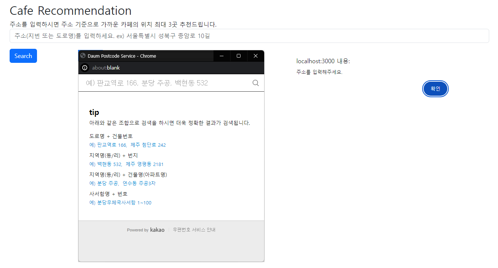
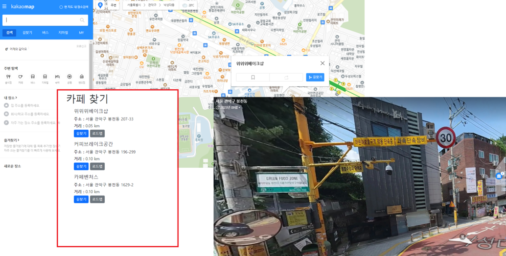

# Cafe-Recommendation

[외부 API(카카오 주소 검색 API](https://developers.kakao.com/docs/latest/ko/local/dev-guide))를 
활용함으로써 혼자 개발하고 마무리 되는 프로젝트가 아닌 실제 서비스 가능한 수준의 프로젝트를 경험 해본다.

추천된 카페의 길 안내는 [카카오 지도 및 로드뷰 바로가기 URL](https://apis.map.kakao.com/web/guide/#routeurl)로
제공 된다.

[카카오 키워드 장소 검색 api](https://developers.kakao.com/docs/latest/ko/local/dev-guide#search-by-category)를
이용하여 카페 외에 편의점, 지하철역, 음식점 등 다른 도메인으로 적용 가능함을 확인할 수 있다.

즉, 다른 도메인의 데이터 또는 api가 존재한다면 새로운 추천 서비스를 구현 해볼 수 있다.

## 요구사항 분석

- 카페 찾기 서비스 요구사항
    - 해당 서비스로 주소 정보를 입력하여 요청하면 위치 기준에서 가까운 카페 3 곳을 추출 한다.
    - 주소는 도로명 주소 또는 지번을 입력하여 요청 받는다.
        - 정확한 주소를 입력 받기 위해 [Kakao 우편번호 서비스](https://postcode.map.daum.net/guide) 사용하였다.
    - 주소는 정확한 상세 주소(동, 호수)를 제외한 주소 정보를 이용하여 추천 한다.
        - ex) 서울 성북구 종암로 10길
    - 입력 받은 주소를 위도, 경도로 변환 하여 가장 가까운 카페를 찾는다.
        - 지구는 평면이 아니기 때문에, 구면에서 두 점 사이의 최단 거리 구하는 공식이 필요
        - 두 위 경도 좌표 사이의 거리를 [haversine formula](https://en.wikipedia.org/wiki/Haversine_formula)로 계산
        - 지구가 완전한 구형이 아니 므로 아주 조금의 오차가 있다.
    - 입력한 주소 정보에서 정해진 반경(10km) 내에 있는 카페만 추천 한다.
    - 추출한 카페 데이터는 길안내 URL 및 로드뷰 URL로 제공 한다.
        - ex)    
          길안내 URL : https://map.kakao.com/link/map/우리회사,37.402056,127.108212    
          로드뷰 URL : https://map.kakao.com/link/roadview/37.402056,127.108212

    - 길안내 URL은 고객에게 제공 되기 때문에 가독성을 위해 shorten url로 제공 한다.
    - shorten url에 사용 되는 key값은 인코딩하여 제공 한다.
        - ex) http://localhost:8080/dir/nqxtX
        - `base62`를 통한 인코딩
    - `shorten url`의 유효 기간은 `30일`로 제한 한다.

## Feature List

- `Spring Data JPA`를 이용한 CRUD 메서드 구현하기
- `Spock`를 이용한 테스트 코드 작성하기
- 카카오 주소검색 API 연동하여 주소를 위도, 경도로 변환하기
- 추천 결과를 카카오 지도 URL로 연동하여 제공하기
- `React`를 이용한 간단한 View 만들기
- `Docker`를 사용하여 컨테이너 애플리케이션 만들기
- `Spring retry`를 이용한 재처리 구현하기 (카카오 API의 네트워크 오류 등에 대한 재처리)
- `base62`를 이용한 `shorten url` 개발하기 (길안내 URL)

## Tech Stack
- JDK 17
- Spring Boot 3.3.2
- Spring Data JPA
- Gradle
- React
- Lombok
- Github
- Docker
- MariaDB
- Spock

## Result

